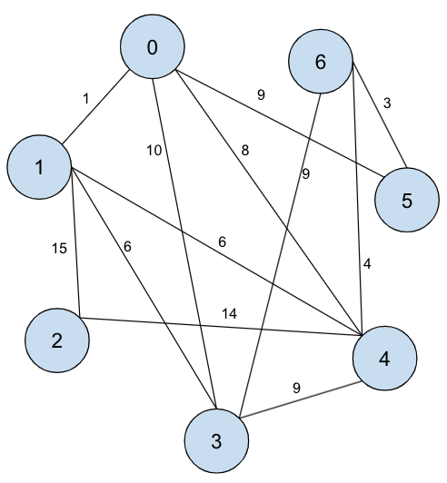

# Homework 6: Graph Search & Dijkstra's

The goal of this homework is to practice and more deeply understand Graph Search and Dijkstra's. This assignment is due on April 4, 2022 at 11:59pm.

### Submitting & Grading
In order to submit this assignment, you must download your code as a ZIP file and upload it to Gradescope. Please include all files.

Your grade on this homework will be out of 11 points:
- LeetCode (3 points)
- Dijkstra Graph Drawing (1 point)
- Autograder (7 points)

### Corrections
If you miss points on this assignment, there will be an opportunity to earn half back by doing homework corrections, so don't worry about the grade if you're having a tough time on some of the questions.

### Academic Integrity
Remember that you can consult outside resources and work with other students as long as you write up your own solutions and cite any links or people you received help from within `citations.txt`.

## Q1. LeetCode: Number of Islands (3 points)

Problem: [Number of Islands](https://leetcode.com/problems/number-of-islands/)

**Q1.A** Provide one set of expected inputs and outputs that is not provided to be sure you understand the question in `Q1.txt`.

**Q1.B** Describe your approach in words in `Q1.txt`. Then, solve the problem. After clicking "Submit" and getting status "Accepted", take a screenshot of the entire window (with the time submitted and your code). Attach the complete and successful screenshot as an image named `Q1.jpg` in your code submissions. Hint: the Flood Fill in-class exercise will be useful here.

**Q1.C** What is the worst case time and space complexity of your approach in terms of m and n?

## Q2. Dijkstra's (8 points)

You should fill in the `getTxstId` function with your TXST ID.  For the examples provided, reference the generated graph below. When you hit run on Replit, you will receive an auto-generated adjacency matrix such as this example:
```
Your adjacency matrix:
[null,    1, null,   10,    8,    9, null]
[   1, null,   15,    6,    6, null, null]
[null,   15, null, null,   14, null, null]
[  10,    6, null, null,    9, null,    9]
[   8,    6,   14,    9, null, null,    4]
[   9, null, null, null, null, null,    3]
[null, null, null,    9,    4,    3, null]
Run Dijktra's starting at node 0
```

**Q2.A (1 point)** Represent your weighted graph as a picture. We recommend using Google Drawings with [this template](https://docs.google.com/drawings/d/19Zc8ytDg-YQuxKag6HKZHCMSl2WZv3tgvyjltpONLdo/edit) that you can make a copy of and use.

Upload your picture as `weighted-graph.png`. You can use the template from above. For reference, the graph representation of the above is as follows 

**Q2.B (1 point)** Take the generated adjacency matrix and translate it into an adjacency list. Put that list in the `getWeightedAdjacencyList` method in `HW6.cpp`. For example, the answer for the example graph above would look like this:
```
  return {
    {{1, 1}, {3, 10}, {4, 8}, {5, 9}},
    {{0, 1}, {2, 15}, {3, 6}, {4, 6}},
    {{1, 15}, {4, 14}},
    {{0, 10}, {1, 6}, {4, 9}, {6, 9}},
    {{0, 8}, {1, 6}, {2, 14}, {3, 9}, {6, 4}},
    {{0, 9}, {6, 3}},
    {{3, 9}, {4, 4}, {5, 3}}
  };
```

**Q2.C (3 points)**

**HIGHLY RECOMMENDED TIPS FOR Q2.C AND Q2.D: **
- *Before doing this question, submit your work to GradeScope at this point to verify that your Q2.B adjacency list looks as expected. This will help sanity check that your drawing / understanding of what your graph looks like is correct *before* you do all the work to run Dijkstra in Q2.C and Q2.D. It would be a bummer to run Dijkstra manually then have to redo your work because of a faulty initial graph.*
- *Before running Dijkstra manually, **make sure you understand the example below.** Fully understanding that example before doing your own will reduce the amount of times you have to submit to GradeScope and wait, and save you a lot of time!*
- *Before moving on to doing Q2.D, make sure that your Q2.C is working as expected by submitting to the autograder (as your answers will be very related). This should also save you time!*

Now we manually run Dijkstra's on your graph starting at the node described by your output ("Run Dijktra's starting at node 0"). Record the changes of `dist` as you run this algorithm into the `getDijkstraDist` method in `HW6.cpp`.
* Note that your starting node may be different depending on your TXST ID.
* **Every time you examine an edge (regardless of whether you update `dist`),
you should add a row to your answer.**
* Like in class, we visit the neighbor with the smallest label first.

For example, here is the answer for the example graph:
```
  return {
    {inf, inf, inf, inf, inf, inf, inf},  // initial
    {0, inf, inf, inf, inf, inf, inf},  // dist[s] = 0
    {0, 1, inf, inf, inf, inf, inf},  // edge: 0 1 update
    {0, 1, inf, 10, inf, inf, inf},  // edge: 0 3 update
    {0, 1, inf, 10, 8, inf, inf},  // edge: 0 4 update
    {0, 1, inf, 10, 8, 9, inf},  // edge: 0 5 update
    {0, 1, inf, 10, 8, 9, inf},  // edge: 1 0
    {0, 1, 16, 10, 8, 9, inf},  // edge: 1 2 update
    {0, 1, 16, 7, 8, 9, inf},  // edge: 1 3 update
    {0, 1, 16, 7, 7, 9, inf},  // edge: 1 4 update
    {0, 1, 16, 7, 7, 9, inf},  // edge: 3 0
    {0, 1, 16, 7, 7, 9, inf},  // edge: 3 1
    {0, 1, 16, 7, 7, 9, inf},  // edge: 3 4
    {0, 1, 16, 7, 7, 9, 16},  // edge: 3 6 update
    {0, 1, 16, 7, 7, 9, 16},  // edge: 4 0
    {0, 1, 16, 7, 7, 9, 16},  // edge: 4 1
    {0, 1, 16, 7, 7, 9, 16},  // edge: 4 2
    {0, 1, 16, 7, 7, 9, 16},  // edge: 4 3
    {0, 1, 16, 7, 7, 9, 11},  // edge: 4 6 update
    {0, 1, 16, 7, 7, 9, 11},  // edge: 5 0
    {0, 1, 16, 7, 7, 9, 11},  // edge: 5 6
    {0, 1, 16, 7, 7, 9, 11},  // edge: 6 3
    {0, 1, 16, 7, 7, 9, 11},  // edge: 6 4
    {0, 1, 16, 7, 7, 9, 11},  // edge: 6 5
    {0, 1, 16, 7, 7, 9, 11},  // edge: 2 1
    {0, 1, 16, 7, 7, 9, 11}  // edge: 2 4
  };
```

We'll be using the following Pseudocode for Dijkstra's:
```
algorithm dijkstras
  Input:
    Graph G = (V, E) where each edge (a, b) ∈ E has cost(a, b) > 0
    int s, the label to indicate the source node that we start on
  Output:
    int[] dist where dist[u] = cost of shortest path from s to u
    int[] prev where prev[u] = node label of the previous node on the shortest
      path from s to u

  dist = new int array of size |V|
  prev = new int array of size |V|
  for v in V
    dist[v] = infinity
    prev[v] = null
  dist[s] = 0

  H = new min priorty queue of the elements in V, ordered by dist
  while H.size() > 0
    u = extractMin(H)
    for each edge (u, v) in E
      if dist[v] > dist[u] + cost(u, v)
        dist[v] = dist[u] + cost(u, v)
	      prev[v] = u
	      decreaseKey(H, v, dist[v])

  return dist, prev
```

**Q2.D (3 points)** Now we manually run Dijkstra's on your graph. Record the changes of `prev` as
you run this algorithm into the `getDijkstraPrev` method in `HW6.cpp`. **Every time you
examine an edge (regardless of whether you update `prev`), you should add a row
to your answer.** 
```
  // We use -1 as a special marker to indicate "no predecessor node".
  return {
    {-1, -1, -1, -1, -1, -1, -1},  // initial
    {-1, 0,  -1, -1, -1, -1, -1},  // edge: 0 1 update
    {-1, 0,  -1, 0, -1, -1, -1},  // edge: 0 3 update
    {-1, 0,  -1, 0, 0, -1, -1},  // edge: 0 4 update
    {-1, 0,  -1, 0, 0, 0, -1},  // edge: 0 5 update
    {-1, 0,  -1, 0, 0, 0, -1},  // edge: 1 0
    {-1, 0,  1, 0, 0, 0, -1},  // edge: 1 2 update
    {-1, 0,  1, 1, 0, 0, -1},  // edge: 1 3 update
    {-1, 0,  1, 1, 1, 0, -1},  // edge: 1 4 update
    {-1, 0,  1, 1, 1, 0, -1},  // edge: 3 0
    {-1, 0,  1, 1, 1, 0, -1},  // edge: 3 1
    {-1, 0,  1, 1, 1, 0, -1},  // edge: 3 4
    {-1, 0,  1, 1, 1, 0, 3},  // edge: 3 6 update
    {-1, 0,  1, 1, 1, 0, 3},  // edge: 4 0
    {-1, 0,  1, 1, 1, 0, 3},  // edge: 4 1
    {-1, 0,  1, 1, 1, 0, 3},  // edge: 4 2
    {-1, 0,  1, 1, 1, 0, 3},  // edge: 4 3
    {-1, 0,  1, 1, 1, 0, 4},  // edge: 4 6 update
    {-1, 0,  1, 1, 1, 0, 4},  // edge: 5 0
    {-1, 0,  1, 1, 1, 0, 4},  // edge: 5 6
    {-1, 0,  1, 1, 1, 0, 4},  // edge: 6 3
    {-1, 0,  1, 1, 1, 0, 4},  // edge: 6 4
    {-1, 0,  1, 1, 1, 0, 4},  // edge: 6 5
    {-1, 0,  1, 1, 1, 0, 4},  // edge: 2 1
    {-1, 0,  1, 1, 1, 0, 4},  // edge: 2 4
  };
```
## Q3. Feedback (Not Graded)

Your responses to these questions will not affect your grade. They help improve or adjust homework assignments or lecture material in the future. 

**Q3.A** Approximately how much time (in hours) did you spend on this homework?
- <2 hours
- 2 - 4 hours
- 4 - 6 hours
- 6 - 8 hours
- 8 - 10 hours
- 10 - 12 hours
- \>12 hours

**Q3.B** Which problem was the most difficult? Any other thoughts?